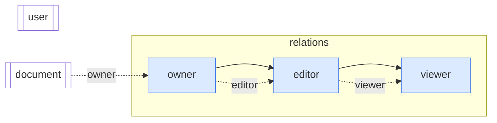
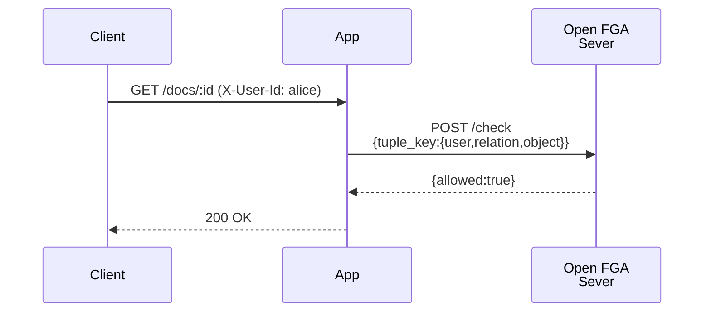
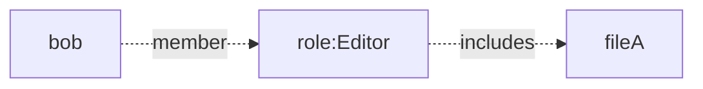
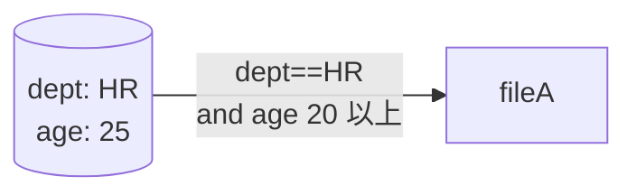
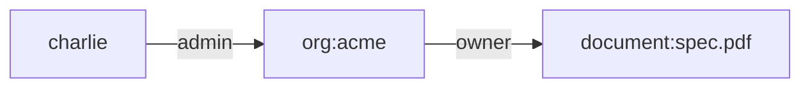

---

## 本記事の目的
- Open FGAのコンセプトを整理する
- Open FGAの使い方を整理する

## 想定読者

- 認可について概要を把握しているソフトウェアエンジニア
  - リソース保護の仕組みだよなあ、くらいでOK

## Open FGAの概要

### Open FGAが生まれた背景

### Relationship-Based Access Control (ReBAC)の概要

- ACL/RBACとの比較

## Open FGA

### FGAサーバセットアップ

### 認可の動作検証

### 認可モデルのテスト

```





## RBAC — 組織内での役割（ロール）に基づいた権限付与



* **長所**

  * 権限定義をロール表に集約でき、ユーザー異動は “ロールの付け外し” だけで済む
  * 実装が比較的単純（DB でも IAM でも広くサポート）
* **短所**

  * 例外が増えるたびロールのコピーを作り **“ロール爆発”** が起きる
  * 多階層ロール（Manager→Lead→…）は if/else ネストになりがち

---

## ABAC — 属性式で動的に判定



* **長所**

  * 時刻・IP・金額など **動的値で柔軟に制御**
  * “ロール” を作らずとも複雑条件を記述できる
* **短所**

  * 判定に必要な属性が各サービスや DB に散在 ⇒ **データ収集が大変**
  * ポリシーが 条件式で増殖し、**「誰が何にアクセスできるか」可視化しにくい**

---

## ReBAC — 関係グラフで認可を表現



* **長所**

  * **継承・委任が自然に書ける**
    *「A が org.admin → org が doc.owner」* のように
    1 本のエッジを足すだけで複雑な多段継承を表現できる。
  * **構造が“グラフ”なので可視化しやすい**
    ノードとエッジを描くだけで、誰がどこ経由で権限を得るか一目で追える。
  * **権限データが 1 フォーマット（タプル）に集約**
    ユーザー属性・ロール表・例外リストを別々に持つ必要がなく、
    ストアが大きくなっても参照箇所が散らばりにくい。

* **短所**

  * **概念が従来 ACL/RBAC から離れており学習コストが高い**
    「権限＝行 or ロール」ではなく「関係＝グラフ」という思考転換が必須。

---

> ✅ **選び分けの指針**
> *動的属性がキー → ABAC*
> *組織・フォルダ階層が深い → ReBAC*
> *小規模で固定ロールだけ → RBAC*

```

---

# 参考
- https://workos.com/blog/what-is-rebac-relationship-based-access-control
- https://workos.com/blog/rbac-vs-abac
- https://openfga.dev/docs/authorization-concepts
- https://auth0.com/blog/jp-whats-the-right-authorization-model-for-my-application/